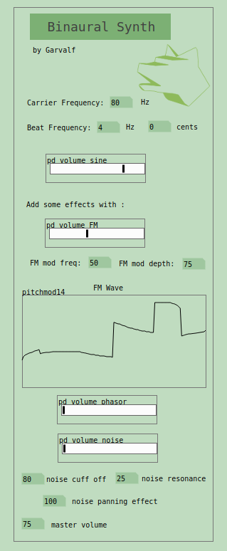
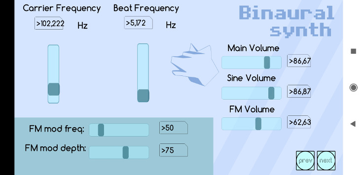

# BIN-8 : Binaural Synth 

This [Pure Data](https://puredata.info/) sound generator is aimed at creating [Binaural Beats](https://en.wikipedia.org/wiki/Binaural_beats).

A beat is an interference pattern between two sounds of slightly different frequencies, perceived as a periodic variation in volume whose rate is the difference of the two frequencies *(wikipedia)*. 

Some believe it might help focusing, distract from outside noises, or induce meditative states. We won't discuss here the scientific validations or refutals.

Binaural Beats are fun! They can create hypnotic drones or high frequencies madness! So let's create some with this simple synth.

## What does it sound like? 

 * https://clyp.it/ufkzshog
 * https://clyp.it/b4evitno
 * https://soundcloud.com/memento-somniare/binaural-drone-2023-02-21

## Usage 

It works with:

 * [Pure Data (Pd) vanilla](https://puredata.info) 
 * [Purr Data](https://agraef.github.io/purr-data/) (a fork based on [Pd-L2Ork](http://l2ork.music.vt.edu/main/make-your-own-l2ork/software/)), which is itself based on the now obsolete Pd Extended.

Just start Pd or Purr-Data, and load the droidparty_main.pd sketch. You can explore the inside of the synth by right-clicking the Binaural Synth and selecting "Open", or by loading the binauralsynth.pd sketch.

 * droidparty_main.pd is the main interface, with some presets 
 * extra.pd has some demo sequences and extra engines
 * binauralsynth.pd is the engine itself
 * you can find an example of a full "song" in the demos/sable folder (sable_test.pd is newer and reuses the synth instead of copying it in its patch, but this version sounds less good at the moment)

 

You can change the base frequency (called carrier frequency), and the beat frequency. The beat frequency will split accross the beat frequency value (if your carrier frequency is 100 Hz, and beat frequency is 6 Hz, the carrier frequency will be 97 Hz on the left and 103 Hz on the right panning.

In addition to the classic, "traditional" Sine wave, you can also add, by increasing their volume:

 * a Sine wave sub bass, which follows the main Sine frequency, one octave lower
 * a FM generator, driven by a few parameters (including the modulation frequency, mod depth, and FM wave).
 * a phaser (sawtooth wave) generator 
 * a square generator
 * a white noise with some filters to make it less harsh. Put cut off to 140, resonance & pan fx to 0 to get the original sound
 * a brown noise (which sounds lower and deeper)
 * a drum beat (kick)

If you connect a MIDI keyboard, you should be able to play the frequencies with the keys! (monophonic)

You can also send CC message (using knobs on your keyboard, if you have some), to alter some parameters. Edit binauralsynth.pd and change the values of the "ctlin" in the (knobs) subprogram.

### VST 

You can use the binaural-synth with the pd-pulp VST, but it's not working correctly at the moment (you have to rename the virtual knobs to pdpulp_p1 *_p2... etc and change use a midi keyboard).

### Android and iOS 

 * There is a droidparty_main.pd which you can used as a standalone Pd app, or on Android with the [PdDroidParty](http://www.droidparty.net/) app. It should also work with [PdParty on iOS](https://github.com/danomatika/PdParty).
 
Just get the binaural.zip file found in the release tab and put the extracted content (folder "binaural") into /storage/emulated/0/Android/data/cx.mccormick.pddroidparty/files on your Android device. On some older devices, you might need to put it into a PdDroidParty folder at the root.

 * There is also a mobmuplat.mmp file which you can use with [MobMuPlat](http://danieliglesia.com/mobmuplat/) (Mobile Music Platform). This template is not much developped, but it can be used as a basis. You can load this file along the Pd files on your smartphone.

## Other great PureData patches

For having other drone / noise PureData patches, have a look at those projects:

- https://github.com/farvardin/nullpainter_drone
- https://github.com/farvardin/LIRA-8/

## Licence 

This software is copyrighted by Eric Forgeot and others.  The following
terms (the "Standard Improved BSD License") apply to all files associated with
the software unless explicitly disclaimed in individual files:

Redistribution and use in source and binary forms, with or without
modification, are permitted provided that the following conditions are
met:

1. Redistributions of source code must retain the above copyright
   notice, this list of conditions and the following disclaimer.
2. Redistributions in binary form must reproduce the above  
   copyright notice, this list of conditions and the following 
   disclaimer in the documentation and/or other materials provided
   with the distribution.
3. The name of the author may not be used to endorse or promote
   products derived from this software without specific prior 
   written permission.

THIS SOFTWARE IS PROVIDED BY THE AUTHOR ``AS IS'' AND ANY
EXPRESS OR IMPLIED WARRANTIES, INCLUDING, BUT NOT LIMITED TO,
THE IMPLIED WARRANTIES OF MERCHANTABILITY AND FITNESS FOR A
PARTICULAR PURPOSE ARE DISCLAIMED. IN NO EVENT SHALL THE AUTHOR
BE LIABLE FOR ANY DIRECT, INDIRECT, INCIDENTAL, SPECIAL,
EXEMPLARY, OR CONSEQUENTIAL DAMAGES (INCLUDING, BUT NOT LIMITED
TO, PROCUREMENT OF SUBSTITUTE GOODS OR SERVICES; LOSS OF USE,   
DATA, OR PROFITS; OR BUSINESS INTERRUPTION) HOWEVER CAUSED AND
ON ANY THEORY OF LIABILITY, WHETHER IN CONTRACT, STRICT
LIABILITY, OR TORT (INCLUDING NEGLIGENCE OR OTHERWISE) ARISING
IN ANY WAY OUT OF THE USE OF THIS SOFTWARE, EVEN IF ADVISED OF
THE POSSIBILITY OF SUCH DAMAGE.

## Credits and Links 

Some code are based on the default Pd sketches (volume output, frequency modulation by wavetable (B05.tabread.FM.pd), moog filter (bob~))

Some open source alternatives:

 * http://gnaural.sourceforge.net/
 * https://uazu.net/sbagen/
 * http://hbx.fdossena.com/
 * https://github.com/chimera0/accel-brain-code/tree/master/Binaural-Beat-and-Monaural-Beat-with-python

